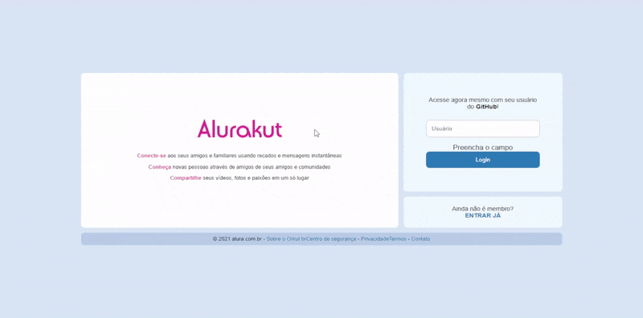

# Alurakut

Project created during the React Immersion, organized by the educational institution Alura, the application is a reinterpretation of the old Orkut website, created with Next.js, styled-components and DatoCMS.

# Technologies

- [Next.js](https://nextjs.org/)
- [DatoCMS](https://www.datocms.com/)
- [styled-components](https://styled-components.com/)
- [JsonWebToken](https://github.com/auth0/node-jsonwebtoken#readme)
- [Nookies](https://github.com/maticzav/nookies#readme)

# Overview



# How to run

```
# Clone this repository
$ git clone https://github.com/velleeda/Alurakut

# Go to the directory
$ cd Alurakut
```

```
# Install Dependencies
$ yarn install

# Run Web Server
$ yarn dev
```

The app will be available in your browser at http://localhost:3000.
